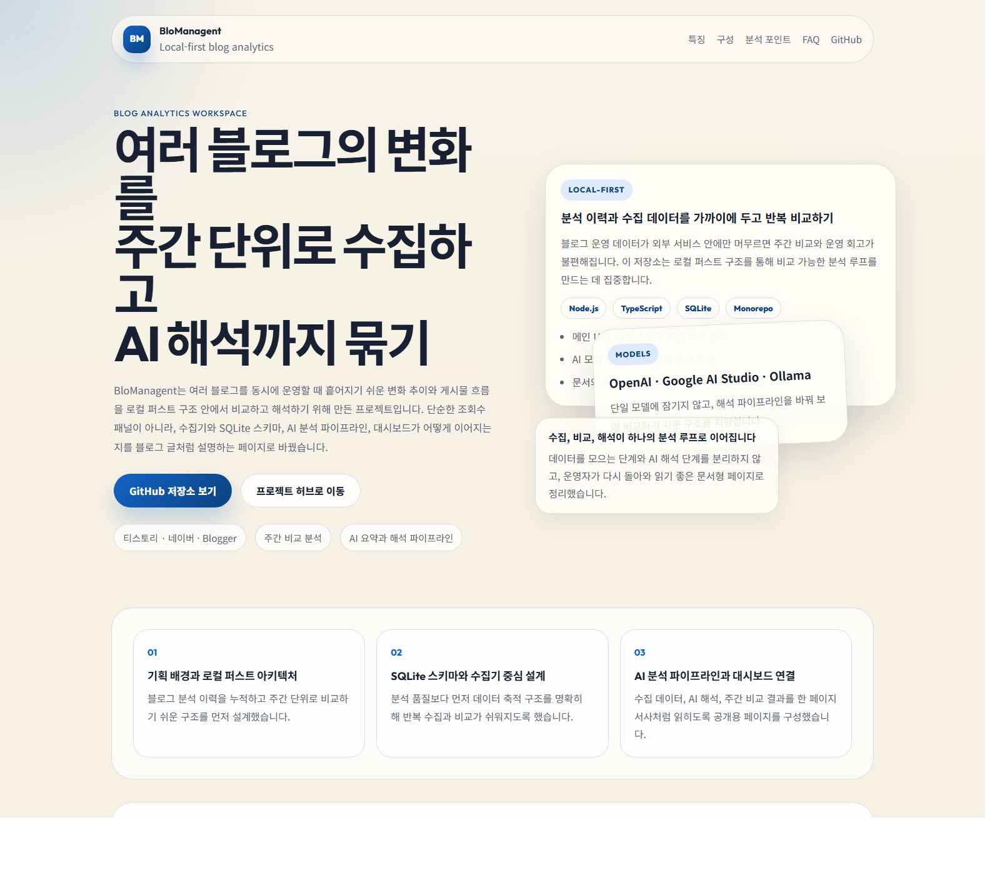

# BloManagent

메인 URL 하나로 공개 블로그를 수집하고, 게시글별 등급과 개선 포인트를 보여주는 로컬 분석 워크스페이스입니다.



## 한눈에 보기

- 저장소: `https://github.com/sheryloe/BloManagent`
- GitHub Pages: `https://sheryloe.github.io/BloManagent/`
- 사용 안내: `https://sheryloe.github.io/BloManagent/help.html`

## 이 프로젝트가 하는 일

BloManagent는 티스토리, 워드프레스, 블로거 같은 공개 블로그를 수집하고, 게시글마다 지금 무엇을 먼저 고쳐야 하는지 보여주는 분석형 도구입니다.

- 블로그 메인 주소만 넣어도 됩니다.
- 개별 게시글 주소를 넣어도 가능한 범위에서 블로그 기준으로 정규화합니다.
- 수집은 공개 RSS, sitemap, wp-json, HTML 범위만 사용합니다.
- 분석은 게시글 단위로 수행합니다.
- 화면은 숫자보다 이해하기 쉬운 `S ~ F` 등급 중심으로 보여줍니다.
- 워크스페이스는 휘발성 흐름에 맞춰 언제든 초기화할 수 있습니다.

## 핵심 차별점

### 1. URL-only 수집

관리자 API 키나 OAuth 없이도 시작할 수 있게 설계했습니다. 블로그 주인이 아니어도 공개 범위 안에서 구조를 분석할 수 있습니다.

### 2. 게시글별 분석

평균 점수 한 줄로 끝내지 않고, 각 게시글에 대해 아래 항목을 함께 보여줍니다.

- 현재 등급
- 강한 신호 상위 3개
- 약한 신호 상위 3개
- 약점 요약
- 개선 제안
- 문단 수, 소제목 수, FAQ 수 같은 raw metric

### 3. Algorithm-first

기본 엔진은 `algorithm`입니다. AI가 없어도 수집, 진단, 리포트, 대시보드까지 전체 흐름이 동작합니다.

- 점수와 등급 계산: algorithm
- 설명 문장 보강: OpenAI / Google / Ollama 선택형
- AI를 켜도 등급은 algorithm 결과를 유지

### 4. Strict verified-post discovery

특히 티스토리에서는 `tag`, `category`, `archive` 같은 비게시글 URL이 섞이는 문제가 자주 생깁니다. BloManagent는 검증된 공개 게시글만 `postCount`로 인정합니다.

- 허용 경로: `/{숫자}`, `/entry/...`
- 차단 경로: `/category`, `/tag`, `/archive`, `/guestbook`, `/notice`, `/manage`, `/search`, `/toolbar`, `/pages`, `/media`
- source order: `RSS -> sitemap -> main fallback`
- `main` fallback은 RSS와 sitemap이 모두 비었을 때만 실행

## 현재 분석 모델

화면에는 등급을 보여주지만, 내부적으로는 게시글별 `qualityScore`를 계산한 뒤 `S ~ F`로 변환합니다.

상위 5개 축은 아래와 같습니다.

- `headlineScore`: 제목과 첫인상
- `readabilityScore`: 가독성
- `valueScore`: 정보 가치
- `originalityScore`: 차별성
- `searchFitScore`: 검색 적합성

등급 컷은 다음과 같습니다.

- `S`: 90+
- `A`: 80+
- `B`: 65+
- `C`: 55+
- `D`: 45+
- `F`: 45 미만

## 지원 플랫폼

| 플랫폼 | 수집 방식 | 비고 |
| --- | --- | --- |
| Tistory | RSS, sitemap, HTML | strict verified-post 적용 |
| WordPress | wp-json, RSS, sitemap, HTML | 공개 REST API 우선 |
| Blogger | RSS/Atom, sitemap, HTML | 공개 피드 중심 |
| Naver Blog | 기본 비활성 | 정책 리스크 때문에 opt-in 필요 |

## 실제 사례

`https://storybeing.tistory.com/` 기준으로 과거에는 비게시글 URL까지 포함돼 글 수가 부풀 수 있었지만, 현재는 아래처럼 검증된 게시글만 집계합니다.

- verified posts: `14`
- `rss: 10`
- `sitemap: 4`
- `main: 0`
- `wp-json: 0`

즉, “홈에서 몇 개 보이는데 앱에서는 왜 더 많지?” 같은 질문에 대해 지금 버전은 명확한 source count와 검증 기준으로 설명할 수 있습니다.

## 화면 구성

### 개요 보드

- 블로그 상태 보드
- 가장 먼저 볼 게시글
- 반복 이슈
- 반복 제목 경고
- 최신 추천 액션

### 수집 작업대

- 주소 입력
- 분석 범위 선택
- 엔진 선택
- 다시 수집
- 분석 시작
- 워크스페이스 초기화

### 리포트 센터

- 평균 등급
- 등급 분포
- 축별 평균 등급
- Best 5 / Worst 5
- 반복 병목
- 실행 로그
- 우선 실행 항목

### 블로그 상세

- 게시글별 진단 카드
- 강한 신호 / 약한 신호
- raw metric
- 약점 요약
- 개선 제안

## 로컬 실행

```bash
npm install
npm run dev
```

배포용 빌드:

```bash
npm run build
npm run start
```

기본 접속 주소:

- 웹: `http://localhost:5173`
- API: `http://localhost:8787`

## 저장소 구조

- [`apps/server`](apps/server): Fastify API, 수집기, 분석 서비스
- [`apps/web`](apps/web): React 기반 분석 대시보드
- [`packages/shared`](packages/shared): 공용 타입과 스키마
- [`docs`](docs): GitHub Pages 문서
- [`docs/notion/BloManagent`](docs/notion/BloManagent): 블로그/노션용 Step 시리즈 원고

## 블로그 시리즈 원고

티스토리나 노션에 그대로 옮겨 쓸 수 있도록 Step 문서를 별도로 정리해두었습니다.

- `Step 1`: 메인 URL 기반 기획
- `Step 2`: 공개 필드 수집기 설계
- `Step 3`: Algorithm 기반 진단 모델
- `Step 4`: 대시보드와 문서 UX
- `Step 5`: strict verified-post discovery

## 정책 범위

이 프로젝트는 공개 데이터 기반 로컬 도구를 지향합니다.

- 로그인 필요 영역은 읽지 않습니다.
- 비공개 글은 수집하지 않습니다.
- 관리자 통계는 수집하지 않습니다.
- 쿠키 우회, 인증 우회, 차단 회피는 하지 않습니다.
- 네이버는 기본 비활성 상태를 유지합니다.

## 앞으로 바로 볼 포인트

- 더 많은 블로그를 넣어도 점수가 뭉치지 않도록 Algorithm V2 적용
- 리포트 화면을 평균 요약형이 아니라 관제형으로 재구성
- README와 GitHub Pages를 제품 문서가 아니라 분석 보고서 문서처럼 재구성

필요하면 다음 단계로는 `Vercel 프론트 + 별도 API 서버` 구조 정리, `Ollama 연결 가이드`, `블로그용 Step 문서 자동 게시` 흐름까지 이어서 확장할 수 있습니다.
